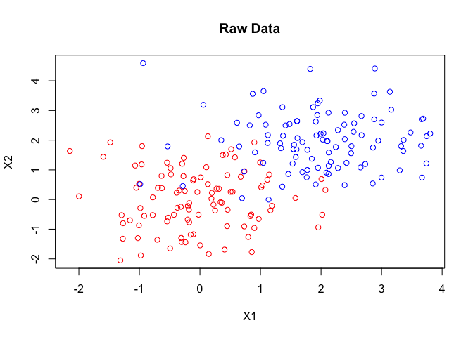
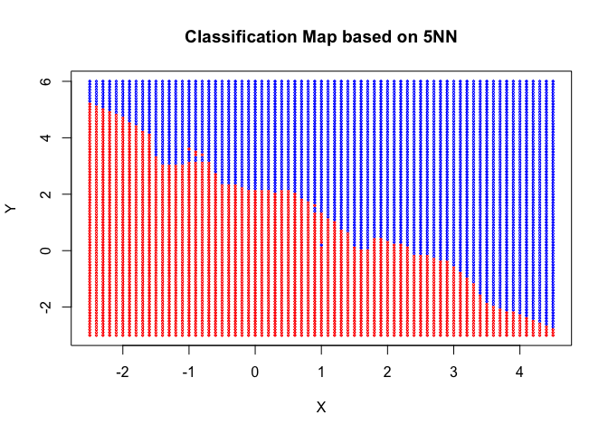
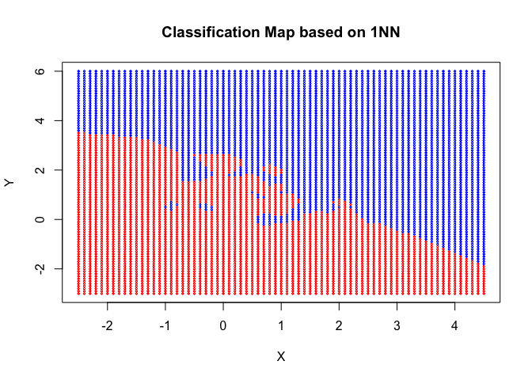
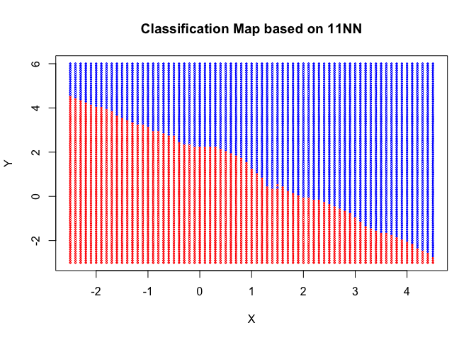

kNN for P-Norms Function
================
William Bell
2018-09-10

This is my attempt to implement the k-nearest neighbours algorithm used often in data science for classification. I start by simulating a dataset made of two clusters that are partially overlapping.

``` r
set.seed(12) ## Do this to make a reproducible simulated dataset

simulatedDataGroup1 <- data.frame(X = rnorm(100), Y = rnorm(100)) ## This is the "reds" who are a group of widgits displaying values one 
## would expect to see from a bivariate regular normal (mu = 0, sd = 1) between two independent variables.
simulatedDataGroup2 <- data.frame(X = rnorm(100, mean = 2), Y = rnorm(100, mean = 2)) ## This is the "blues" who are a group of widgits
## with a similar distribution but ofset in both variables by 2 units up and to the right.

combinedData <- data.frame(matrix(nrow = 200, ncol = 2))                                                                    
combinedData[1:100, ] <- simulatedDataGroup1
combinedData[101:200, ] <- simulatedDataGroup2 ## This is our complete simulated dataset
groupMembership <- c(rep("red", 100), rep("blue", 100)) ## ... and our record of their group membership.

plot(combinedData, col = groupMembership, main = "Raw Data")
```



Next I define the functions of interest. The first function takes in all the classified data we have so far, a point we are interested in looking at, and a choice p-norm (input can be any natural number or Inf), and it outputs the distance using that norm from the unclassified point of interest to every classified point. This is "fast enough" for the datasets we consider (the ~6400 iterations of it in each nested loop using 200 data points takes about 6 seconds), but it isn't the ideal implementation, we will consider some more blackbox-y implementations later. The second function uses the first, it finds the k nearest points using the distances calculated with the first, and uses the classifications of those to 'vote' on the classification of our final point.

``` r
distNeighbours <- function(classifiedData, unclassifiedPoint, p = c(1L, 2L, Inf)) {
  di <- classifiedData
  for (i in 1:length(unclassifiedPoint)) { ## This produces the absolute differences in all dimensions of our point from every other point.
    di[ , i] <- abs(classifiedData[ , i]-unclassifiedPoint[i])
  }
  if (is.finite(p)) { ## If p is a natural number (not the infinity norm)...
    exponentiated <- di^p
    distance <- rowSums(exponentiated)
    distance <- distance^(1/p) ## Then do sum(row^p)^(1/p) (the p-norm), if p=2 this is often called the l2 or Euclidean norm, if p=1 this
    ## is the l1 or taxicab norm.
  }
  else if (is.infinite(p)) { ## If p is Inf (infinity)...
    distance <- apply(di, 1, max) ## Then do max(row), which is the p-norm as p -> +infinity, thus we've implemented every p-norm in this
    ## function, we could have implemented other distance measures as well, but I think these are the most common numeric vector norms, and
    ## also the most relevant for my purposes.
  }
  else { ## And for the indecisive...
    exponentiated <- di^2
    distance <- sqrt(rowSums(exponentiated)) ## We have the l2 or Euclidean norm as a default, but...
    warning("No or unknown distance measure given, defaulting to p=2/euclidean norm.") ## we better warn them of their indecision.
  }
  distance
}

kNN <- function(classifiedData, classification, unclassifiedPoint, k, p = 2) {
  distances <- distNeighbours(classifiedData, unclassifiedPoint, p) ## Once we have the distances to every point
  kthneighbour <- sort(distances)[k] ## Find the distance to the kth closest point
  kNN <- classification[distances <= kthneighbour] ## And find out which group all the points at most that distance away are
  conclusion <- table(kNN)/k ## Collect the votes (each of those neighbours gets a vote as to what a given point is based on what they 
  ## are) and make the values into proportions
  list(results = conclusion, k = k, p = p) ## And return results, including some information on how we collected the results
}
```

Your choice of distance measure (in this case, p-norms) will depend on your data. P-norms are a large class (a countably infinite class) of distance measures, the most common distance measures used in analysis of continuous data are all p-norms (e.g. l2/euclidean, l1/taxicab, and the infinity norm). Choice of distance measure should be one of the most carefully thought out part of the k-nearest neighbours process.

Next I show what the classifications would be for any novel points, by location, classifying the space as either red or blue starting with 5 nearest neighbours.

``` r
XInt <- seq(-2.5, 4.5, by = 0.1) ## Choose some x and y values that span the data to use to map how this would classify areas of the space
YInt <- seq(-3, 6, by = 0.1)

colMatrix5 <- matrix(nrow = length(YInt), ncol = length(XInt))

for (j in 1:length(XInt)) { ## This loop only works for odd numbers because it doesn't have a case in order to handle a tie, that is very
  ## easy to fix, but why bother since there are so many odd numbers we can choose from (unless we wish to make this a function, which
  ## considering the number of times we use it in this script, might be a worthwhile activity!).
  for (i in 1:length(YInt)) {
    NN5 <- kNN(combinedData, 
               groupMembership, 
               c(XInt[j], YInt[i]), 
               k = 5, ## We are considering the five nearest neighbours in this version.
               p = 2)
    colMatrix5[i, j] <- names(NN5$results[NN5$results == max(NN5$results)])
  }
}

rm(NN5, i, j)

Xwhich <- rep(NA_integer_, length(colMatrix5))

for (i in ((1:length(XInt))-1)) {
  Xwhich[(1+i*length(YInt)):(length(YInt)+i*length(YInt))] <- (i+1)
}

pointLocations <- data.frame(X = XInt[Xwhich], Y = rep(YInt, length(XInt))) ## The coordinates of all the points we found the 'majority
## vote' for in our nested loop.
coloursPoints5 <- c(colMatrix5) ## The 'majority votes' converted to a vector

plot(pointLocations, col = coloursPoints5, cex = 0.3, main = "Classification Map based on 5NN")
```



If we think that there are going to be more local areas where the points are a different category, or if there is an unbalanced dataset, it might be advisable to use a smaller number for k.

``` r
colMatrix1 <- matrix(nrow = length(YInt), ncol = length(XInt))

for (j in 1:length(XInt)) { ## Same comment as previous loop
  for (i in 1:length(YInt)) {
    NN1 <- kNN(combinedData, 
               groupMembership, 
               c(XInt[j], YInt[i]), 
               k = 1, 
               p = 2)
    colMatrix1[i, j] <- names(NN1$results[NN1$results == max(NN1$results)])
  }
}

rm(NN1, i, j)

coloursPoints1 <- c(colMatrix1)

plot(pointLocations, col = coloursPoints1, cex = 0.3, main = "Classification Map based on 1NN")
```



If we think that there will be fewer, larger clusters for each group, we might be better advised to use larger values for k. This 'smoothes out' the classification map more.

``` r
colMatrix11 <- matrix(nrow = length(YInt), ncol = length(XInt))

for (j in 1:length(XInt)) { ## Same comment as previous loop
  for (i in 1:length(YInt)) {
    NN11 <- kNN(combinedData, 
               groupMembership, 
               c(XInt[j], YInt[i]), 
               k = 11, 
               p = 2)
    colMatrix11[i, j] <- names(NN11$results[NN11$results == max(NN11$results)])
  }
}

rm(NN11, i, j)

coloursPoints11 <- c(colMatrix11)

plot(pointLocations, col = coloursPoints11, cex = 0.3, main = "Classification Map based on 11NN")
```


